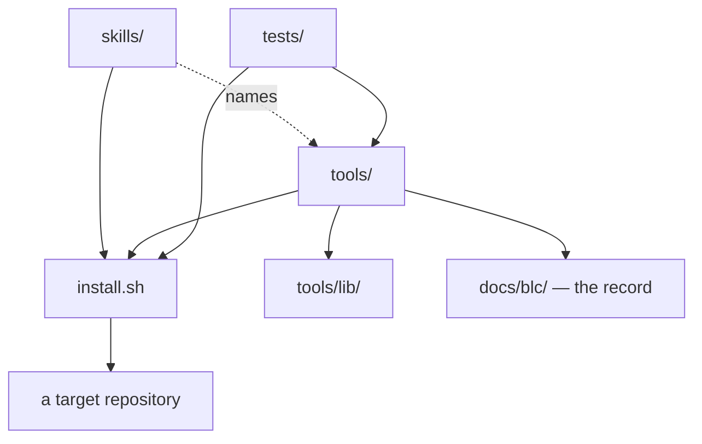

# Architecture

`brief-ledger-chronicle` is a toolkit that installs into other repositories. It ships three kinds
of thing: **skills**, which instruct an agent; **tools**, which are shell scripts an agent or a
person runs; and a **record format** under `docs/blc/`, which the tools read and write.

There is no service and no build. The installer copies files, and everything else is a shell
script reading Markdown and git.

The diagram is the shape. The lists below are the evidence: every edge it draws is restated
there with the code that proves it.

## The parts

- `install.sh` is the whole distribution mechanism — argument parsing, the ownership map, and the
  copying, in one script. <!-- cite: install.sh :: place_dir() -->
- `skills/` holds one directory per skill, each a single `SKILL.md`. Six of them are process
  skills, which Claude Code takes as slash-commands rather than skills. <!-- cite: install.sh :: PROCESS_SKILLS= -->
- `tools/` holds the scripts. They are the half of the toolkit that can be tested, because a
  skill is instructions and a script is behaviour. <!-- cite: tools/validate-briefs.sh -->
- `tools/lib/` holds shared shell functions, sourced by the tools rather than executed. <!-- cite: tools/lib/status-line.sh :: blc_ledger_scan() -->
- `docs/blc/` is the record: briefs, their ledgers, chronicles, contracts, and per-contributor
  declarations. <!-- cite: docs/blc/contracts/v1.3.md -->
- `tests/` is a shell test suite with its own runner. <!-- cite: tests/run.sh :: blc_awk_plan() -->
- `templates/` holds files the installer writes into a target and keeps owning: one
  `process-rules.md` body goes to two destinations, because Cursor needs YAML frontmatter and
  Claude Code does not. <!-- cite: install.sh :: One process-rules.md body, two destinations -->
- `personal/` belongs to the other install mode. `--machine` links one file into the agent's
  home directory rather than into any project. <!-- cite: install.sh :: $SCRIPT_DIR/personal/CLAUDE.md -->

## How the tools reach the libraries

Every tool that needs a library sources it by name in a loop, and refuses to run if it is
missing. The libraries do not source each other, so each caller names the full set it needs, in
dependency order.

- `validate-briefs.sh` sources three libraries. <!-- cite: tools/validate-briefs.sh :: for BLC_LIB in phase-row status-line identity-line -->
- `jira-csv.sh` sources the same three in a different order. <!-- cite: tools/jira-csv.sh :: for BLC_LIB in status-line identity-line phase-row -->
- `list-briefs.sh` sources the touch log instead of the phase row. <!-- cite: tools/list-briefs.sh :: for BLC_LIB in status-line identity-line touch-log -->
- `open-briefs.sh` sources two, then reaches for `detect-forge.sh` as a sibling script rather
  than a library. <!-- cite: tools/open-briefs.sh :: BLC_DETECT_FORGE= -->
- `orient.sh` sources the touch log only if it is readable, and degrades to a worse answer
  rather than failing. <!-- cite: tools/orient.sh :: if [ -r "$TOUCH_LIB" ]; then -->

`check-architecture.sh` and `detect-forge.sh` source nothing. They are leaves.

## What each library owns

- Parsing a brief's identity line into fields. <!-- cite: tools/lib/identity-line.sh :: blc_identity_field() -->
- Matching a phase row in a ledger's table. <!-- cite: tools/lib/phase-row.sh :: blc_phase_row_pattern() -->
- Reading a ledger's `blc/2` status line. <!-- cite: tools/lib/status-line.sh :: blc_status_line() -->
- Following renames in git history, so a moved file keeps its age. <!-- cite: tools/lib/touch-log.sh :: blc_touch_renames() -->

## What the installer writes, and what it never writes

`install.sh` answers both questions itself, without a target, which is how a project can check
the answer before running it. <!-- cite: install.sh :: --print-ownership -->

Toolkit-owned trees are replaced wholesale on every install: the directory is removed and
copied again, so a local edit does not survive. <!-- cite: install.sh :: place_dir() -->

Project-owned paths are written once and never again, and `docs/architecture/` — this document —
is one of them.

## How the record is checked

`validate-briefs.sh` is the gate on the briefs directory. It runs the toolkit's own contract
clauses first, then every script a project put in `brief-checks/`, so a project can add rules
about its own record without editing a toolkit-owned file. <!-- cite: tools/validate-briefs.sh :: checks_dir="$repo_root/brief-checks" -->

`check-architecture.sh` is the gate on this file. It reads each citation above, and reports any
whose file is gone or whose anchor no longer appears. It reports; it does not fail. <!-- cite: tools/check-architecture.sh :: anchor not found -->

## How it is tested

`tests/run.sh` is both the runner and a matrix driver. It discovers the `awk` implementations on
the machine and runs the whole suite once per implementation, because the tools parse Markdown
with `awk` and the implementations disagree. <!-- cite: tests/run.sh :: BLC_AWK_CANDIDATES= -->

CI runs the same suite, and installs `original-awk` first so that a missing interpreter is not
reported as coverage. <!-- cite: .github/workflows/test.yml :: original-awk -->
